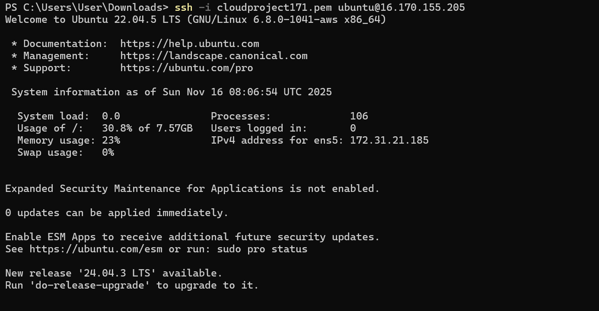
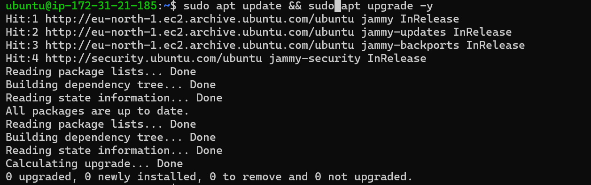
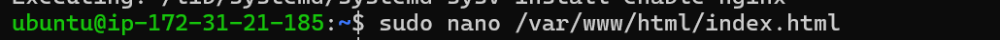
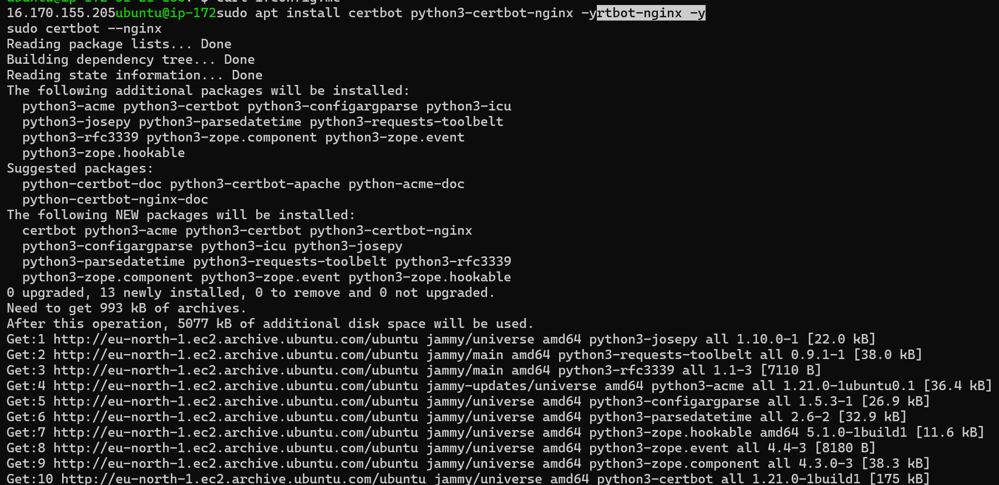
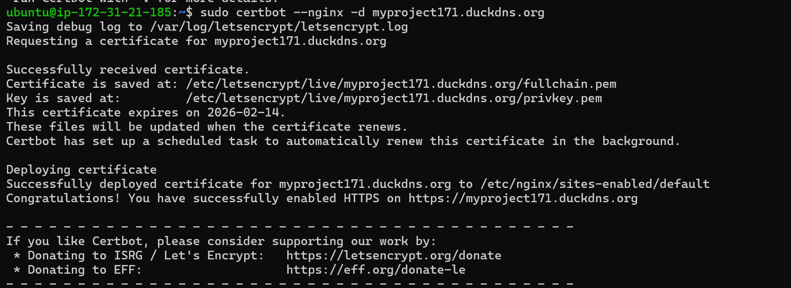
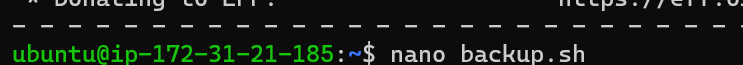
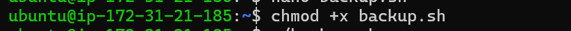
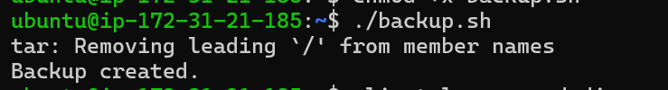

# ICT171 Cloud Server Project
Student: Sonia Mahajan
Student ID: 35834886

# Public IP Address:
16.170.155.205

# Domain
https://myproject171.duckdns.org/

# Steps I followed:
- Launched EC2 Ubuntu 22.04 cloud server
- SSH into server
- Installed nginx
- Edited /var/www/html to customize website
- Setup the DuckDNS domain: myproject171.duckdns.org
- Installed SSL
- Created backup script
- Documented everything in GitHub

---

# Commands Used

## Installing updates:
sudo apt update && sudo apt upgrade -y

## Install nginx:
sudo apt install nginx -y

## Edit web files:
sudo nano /var/www/html/index.html

## Install Certbot:
sudo apt install certbot python3-certbot-nginx -y

## Enable HTTPS:
sudo certbot --nginx -d mycloudprj.duckdns.org

## Create script:
nano backup.sh

## Make script executable:
chmod +x backup.sh

## Run script:
./backup.sh

# Video Link
https://youtu.be/hugz6yTGWcQ
